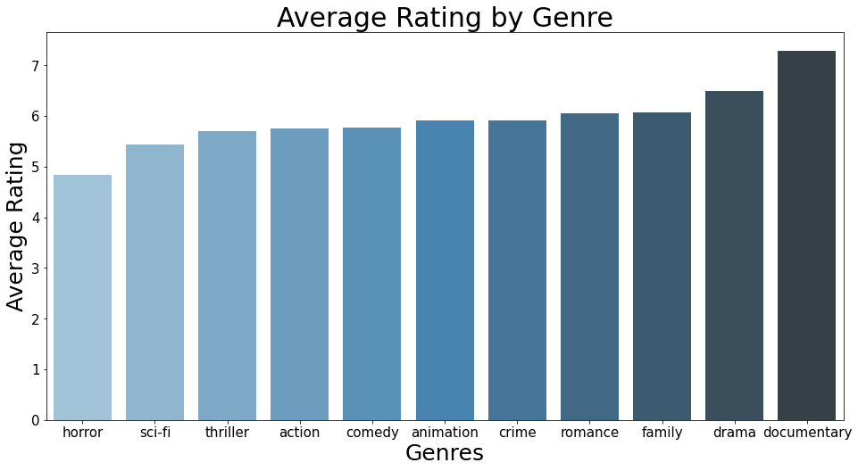

# dsc-biz-phase1proj

**OVERVIEW**

**BUSINESS UNDERSTANDING**

**DATA UNDERSTANDING & ANALYSIS**

**CONCLUSION**

## 1
**Analysis of Genres Vs Average Rating**
The question this section sought to answer was which movie genres had the best and worst results in terms of average rating. The goal being to provide insight to Microsoft executives as to which movie genres they ought to focus their resources on.

For this analysis we used the IMDB data located in the SQLite database. Specifically, we joined the movie_basics and movie_ratings tables in order to compare genres to average ratings. To clean the data, we started by looking at the null values. Out of 73,856 total entries, 1.08% of the 'genres' column (804 entries) contained null values, and thus were removed from the dataset. The average rating column contained no null values. The dataset contained many categories for genre, including single-genre categories such as 'Drama' and crossover genre categories such as 'Crime, Drama, Mystery". For the purpose of this analysis we narrowed our focus to examine only single-genre categories with 200 or more entries. This amounted to looking at 34,883 entries out of 73,052. Ideally, we would have analyzed the crossover genre categories as well but due to time restraints we decided to leave the crossover genres out. This is something that could be improved upon at a later time. To explore the data, we started by using the .mean() function to find the average rating for each of the selected genres. We then created a new dataframe and utilized Seaborn in order to clearly visualzie the results.

The following results show the genre categories that met our analysis criteria along with their average ratings, ordered from highest to lowest:
Documentary : 7.29 , 
Drama : 6.49 ,
Family : 6.07 ,
Romance : 6.05 ,
Crime : 5.92 ,
Animation : 5.90 ,
Comedy : 5.77 ,
Action : 5.75 ,
Thriller : 5.70 ,
Sci-Fi : 5.44 ,
Horror : 4.83 

CONCLUSION #1:

The genre category 'Documentary' had the highest average rating of 7.29, while the category 'Horror" had the lowest average rating of 4.83. Genre is an important factor to consider when determining which types of movies to make and how well they might be received by viewers.

## 2

## 3
