# Overview

Microsoft is looking to get into the movie business and create an original content studio. Our goal is to answer three questions we think are important considerations, and hopefully provide them with actionable insight and recommendations. The questions we considered are as follows:

1.) Which movie genres receive the highest average ratings?

2.) Does movie runtime have an impact on ratings?

3.) What affects does production budget have on important metrics such as total gross, popularity, and moving rating?

Our data was sourced through Flatiron school and can be found here [ProjectData](https://github.com/learn-co-curriculum/dsc-project-template/tree/template-aab). The relevant data is located in the zippedData/ folder in the template-aab or template-mvp branch.
    
# Data Preparation and Analysis

## Analysis of Genres Vs Average Rating 

The question this section sought to answer was which movie genres had the best and worst results in terms of average rating. The goal is to provide insight to Microsoft executives as to which movie genres they ought to focus their resources on.

For this analysis, we used the IMDB data located in the SQLite database. Specifically, we joined the movie_basics and movie_ratings tables to compare genres to average ratings. To clean the data, we started by looking at the null values. Out of 73,856 total entries, 1.08% of the 'genres' column (804 entries) contained null values and thus were removed from the dataset. The average rating column contained no null values. The dataset contained many categories for the genre, including single-genre categories such as 'Drama' and crossover genre categories such as 'Crime, Drama, Mystery". For this analysis, we narrowed our focus to examine only single-genre categories with 200 or more entries. This amounted to looking at 34,883 entries out of 73,052. Ideally, we would have analyzed the crossover genre categories as well but due to time restraints, we decided to leave the crossover genres out. This is something that could be improved upon at a later time. To explore the data, we started by using the .mean() function to find the average rating for each of the selected genres. We then created a new dataframe and utilized Seaborn to visualize the results.

The following results show the genre categories that met our analysis criteria along with their average ratings, ordered from highest to lowest: Documentary: 7.29, Drama: 6.49, Family: 6.07, Romance: 6.05, Crime: 5.92, Animation: 5.90, Comedy: 5.77, Action: 5.75, Thriller: 5.70, Sci-Fi: 5.44, Horror: 4.83.

The genre category 'Documentary' had the highest average rating of 7.29, while the category 'Horror" had the lowest average rating of 4.83. Genre is an important factor to consider when determining which types of movies to make and how well they might be received by viewers.

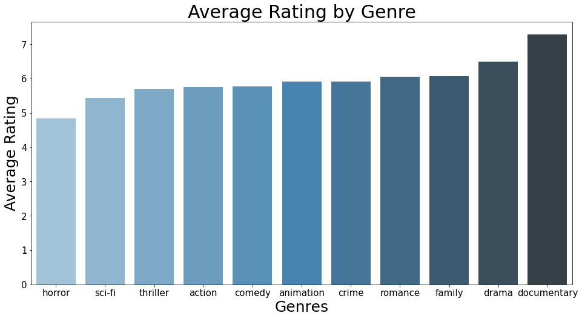

## Analysis of Movie Runtime Vs Average Rating

The question this section sought to answer was whether there exists a relationship between runtime in minutes and movie rating and whether we can give an actionable recommendation to Microsoft executives based on our findings. Perhaps they can optimize their movie runtimes to yield better ratings.

For this analysis, we used the IMDB data located in the SQLLite database. We started with the same query as the previous question, joining the movie_basics and movie_ratings tables to compare runtime in minutes to average ratings. By joining these two tables, we have access to all the relevant features.

Initially, there were several records with null values for runtime in the dataframe equating to 10% of our total data. We agreed that, while toeing the line for what is an acceptable amount of data to drop, dropping the null values would still be the best course of action. We did not want to fill them with the mean or median to avoid skewing our data towards the center.

The next step in the cleaning process was to filter out the outliers. Based on accepted definitions, we considered outliers anything above the outer bounds of the IQR plus 1.5 times the IQR. We then decided to make a new dataframe by adjusting our SQL query. We filtered our query to only include movies with runtimes within our established range of outliers. Furthermore, we grouped our records by the runtime and took the average of average ratings, giving us the average rating for a movie of each unique runtime. This would allow us to better explore the relationship between features.

We calculated the correlation between runtime in minutes and average movie rating for our new dataframe, and found a correlation of -0.536, a moderate negative correlation. This would seem to suggest that shorter movies tend to have higher ratings. We then made a scatterplot of the average rating by the runtime in minutes to see if the trend was visually apparent. This is what we found:

As we can see, movies with shorter runtimes, in particular those under an hour long, do seem to have higher ratings. Qualitatively, we can see that ratings steadily decrease until bottoming out around 80-100 minutes, after which they steadily increase once more until stabilizing around 120 minutes.

However, we need to consider that the points in this scatter plot are not weighed evenly - indeed, some runtime categories may have very few movies of that length, which could also skew our data. We hopefully took care of some of this by filtering to remove our outliers, but perhaps we can get more granular with our data restriction.

To do this, we made a new dataframe from a new SQL query where the count of runtime_minutes is included as a factor. This way, we can prevent the inclusion of movie runtime categories that only have a very small amount of movies in the category (i.e. amount of movies with a specific runtime) which could potentially be skewing our data. We chose to limit the data to movie runtimes with over 100 movies that have that particular runtime, based on the accepted definition of a valid sample size according to tools4dev.org.

We then took another look at the correlation between runtime and average rating, and we can see that it has stayed the same upon adding that further restriction to our dataframe. We can now confidently say that the correlation between runtime in minutes and the average rating for movies in this dataset is -0.536, a moderate negative correlation.

We plot one more time, and we can see that the graph has stayed largely the same, if not identical.

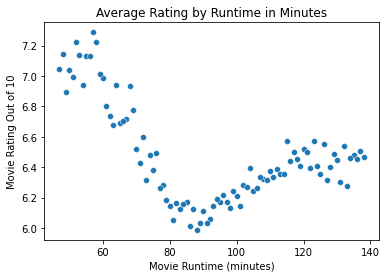

For context, we've made one final graph including the number of movies with each runtime. As we can see, the larger points in the scatterplot below correspond to movie runtime categories that have more movies of said runtime. Analyzing this, it is clear that there are significantly more movies with runtimes between 80 and 100 minutes than those with runtimes at the edges of the plot. That said, it is still worth noting that movies analyzed with a runtime of around 60 minutes consistently rate higher than those with a runtime between 80 and 100 minutes. We also see a second peak in our distribution, with movies around 120 minutes rating higher than those in the middle.

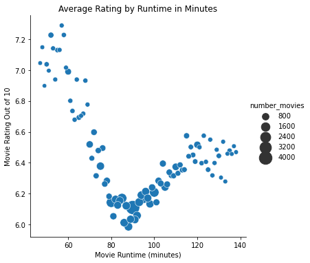

Considering this data, we can recommend Microsoft that producing shorter movies under 60 minutes is most likely to be received positively. However, producing movies around 120 minutes are possibly more well-received than those between 80 and 100 minutes.

## Comparison with Budget and Gross

The final step in the process was to compare various metrics from the IMDB SQL database with metrics for the production budget and total gross from the Numbers CSV file. The first step in the process required cleaning the two dataframes to have a matching size and then finally merging them into a final data frame to conduct an analysis. This process first required creating a unique identifier for both of the dataframes and cleaning them based on the movies present in both dataframes. The most obvious unique identifier to use as movie title plus release year. This narrowed down both dataframes and, after removing some duplicates from the IMDB dataframe, allowing them to be merged resulting in the table below.

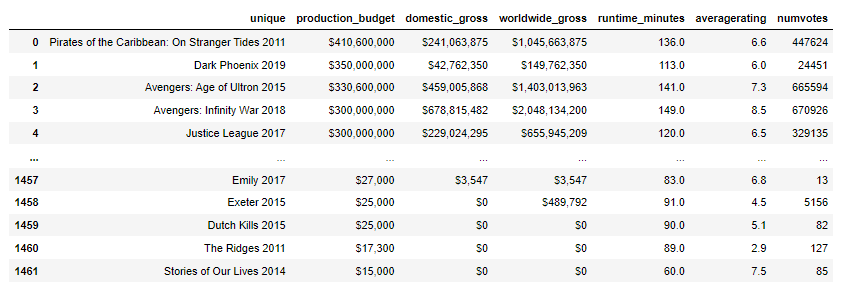

The following table was also required to analyze the budget vs. total gross. This table was favored over the previous one as it contains more data points. The table below shows the cleaned version.

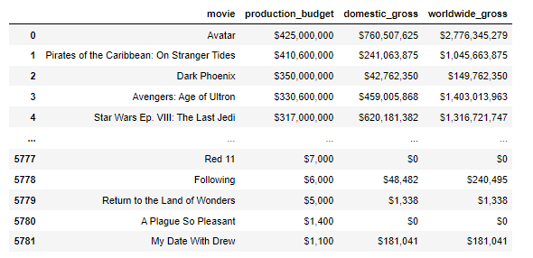

The final step was to do some final formatting for clean modeling. This required writing a function to remove $ and , from the relevant columns and also divided by one million for cleaner-looking visualizations. With the data ready for visualization and analysis, the correlation tables were generated, as seen below.

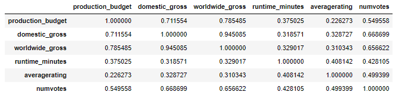
    

The first obvious question to answer from the merged data set was, "Does production budget affect average rating?" The first metric to analyze here is the correlation. The correlation coefficient between the production budget and average rating was only 0.226273, which suggests a weak positive relationship. Looking at the regression plot below, the data appears to be fairly spread out and no additional patterns emerge from the analysis of this plot. It can be concluded that the overall budget has little to no impact on the average rating of a movie. Hence, a high production budget will not necessarily yield what the public considers to be a high-quality movie.

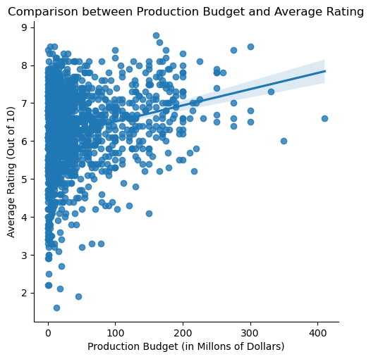

A natural follow-up question to this would be, "Does the production budget affect the overall popularity, whether positive or negative, of the movie." To answer this question, an analysis of the production budget versus the total number of votes will be conducted. The correlation coefficient between these two values is 0.549558, which implies a moderate positive relationship between the production budget and the number of votes. Looking at the regression plot below shows a much tighter data set than the previous plot. There do appear to be multiple outliers which likely represent low-budget cult classics. These data points were left in the analysis as they represent real variations in the data. Overall, it appears that a higher production budget has a slightly positive impact on the overall popularity of the movie.

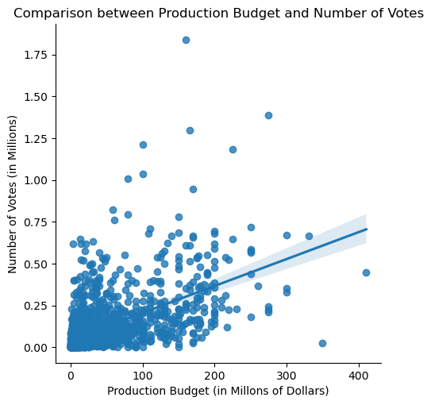

The final question to ask from the merged data set is, "Does movie runtime have any effect on the worldwide gross?" The correlation coefficient between these two is 0.329017, which indicates a weak positive relationship. Looking at the regression plot below, it appears that the data is spread out in a similar matter to the plot of the production budget and average rating. No patterns appear to emerge from this plot. Therefore, it does not appear that the run-time has little to no impact on the overall gross of the movie.

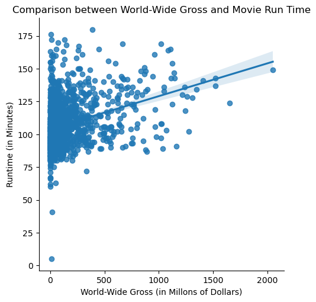

Moving on to the Numbers dataset, the questions that come to mind are, "Does production cost affect domestic and worldwide gross? Looking at the correlation between production budget and domestic/worldwide gross, 0.685682 and 0.748306 respectively, it is apparent that there is a strong linear relationship between production budget and both domestic and worldwide gross. The figures below reinforce this as the data appears to be much more condensed when compared to the previous data sets. Overall, a higher-budget film will generally yield a higher gross in both domestic and worldwide markets. However, this brings up a limitation of the data. The data sets do not contain information about the distribution and advertising costs; therefore, profits cannot be compared to any of the metrics. Knowing the profits as well as specific distribution costs would help reinforce the current data as well as help to make informed decisions on whether or not to limit distribution to a domestic market or expand into the global market. Higher gross does generally yield higher profits so it is still reasonable to recommend higher-budget movies in a domestic market. There is not enough data at this time to recommend expanding into a worldwide market as it is unclear whether the increase in gross and increase in distribution costs is enough to yield higher profits.

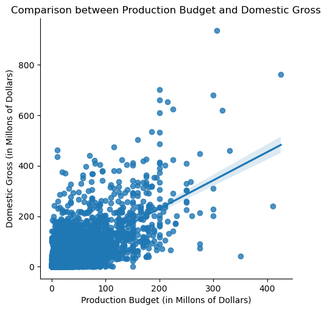
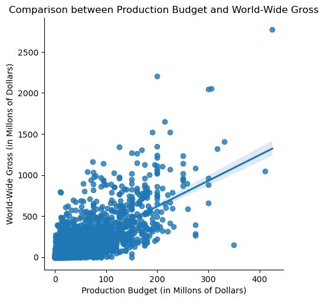

# Conclusion

The purpose of this study is to make recommendations for Microsoft's entry into the movie industry. We sought to answer questions about various movie metrics and have come to the following conclusions:

An analysis of genre and average ratings showed that documentaries receive the highest average rating while horror movies receive the lowest average rating.
    
An analysis of runtimes and ratings showed that movies less than 60 minutes long as well as around the 120-minute mark have higher average ratings.

An analysis of the production budget and various metrics found that the production budget has a strong positive relationship with domestic and worldwide gross and     production budget has a moderate positive relationship with overall popularity, represented by the number of rating votes for a movie.
    
From the above conclusions, it appears that making documentaries around 60 minutes or 120 minutes will yield the highest ratings. This will build the popularity of the studio as they will have a high probability of releasing well-received movies. In addition, a moderate to high production budget will further increase popularity and will also allow for a higher total gross. One limitation of this study is that there was no available data for distribution and advertising costs. Due to this limitation, we cannot recommend based on expected profits and cannot recommend whether to expand into a global market, as there is no data involving the associated costs in doing so and if they outweigh the additional profits. Another limitation of this study was that, due to time constraints, crossover movies, movies with more than one genre, were not considered. A recommended follow-up study would contain data on the distribution and advertising costs as well as an analysis including crossover movies.
